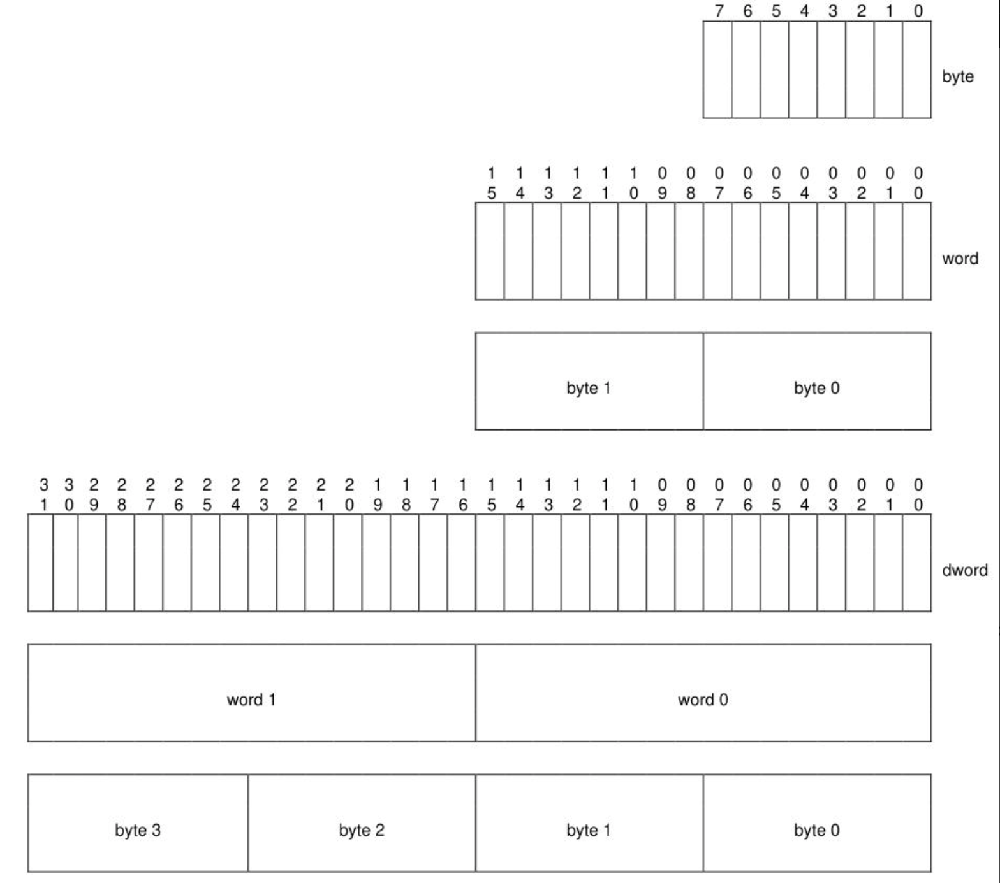

# 1 引言

## 1.1 概述
NVM Express(NVMe)接口允许主机软件与非易失性内存子系统交互。该接口针对企业级和消费级固态硬盘进行了优化，通常作为寄存器级接口连接到PCI Express接口。

注：在开发过程中，该规范被称为企业NV MHCI。然而，在完成之前该名称已修改为 NVM Express base Specification。该接口同时针对客户级和企业级系统。

要了解从 1.3 版到 1.4 版的变化，请参阅 http://nvmexpress.org/changes 的文档，该文档描述了新功能，包括控制器必须符合 1.4 版的强制要求。

### 1.1.1 NVMe Over PCIe and NVMe Over Fabrics

NVM Express基础规范修订版1.4和之前的版本为主机软件通过PCI Express（NVMe TM over PCIe TM）与非易失性存储器子系统通信定义了寄存器级接口。NVMe TM over Fabrics规范定义了协议接口和与NVMe接口在其他网络（例如Ethernet、InfiniBand、Fibre Channel）上的相关扩展。The NVMe over Fabrics specification has an NVMe Transport binding for each NVMe Transport (either within that specification or by reference).

在本规范中，需求或功能可能被记录为特定于NVMe over Fabrics实现或特定于NVMe Transport绑定。此外，功能及其支持要求在NVMe over PCIe和NVMe over Fabrics中的实现可能有所不同。

## 1.2 适用范围

该规范定义了与NVM子系统中的控制器通信的寄存器接口，还定义了可能由控制器支持的标准命令集，有三种类型的控制器具有不同的功能：a）I/O控制器；b）发现控制器；c）管理控制器（参见第7.1节）。

在本文中，如果控制器类型可以根据上下文确定时，通常使用通用术语controller来代替特定的控制器类型。

## 1.3 范围以外

寄存器接口和命令集与NVM任何使用模型无关，而只是指定了与NVM子系统的通信接口。因此，该规范没有指定NVM系统是否用作固态驱动器、主存储器、缓存存储器、备份存储器、冗余存储器等。特定的使用模型在范围之外，是可选的，并且没有授权。

该接口在任意NVM管理功能之上定义，如磨损均衡。擦除和其他针对NAND 等 NVM 技术的管理任务被抽象了。

本规范不包含任何缓存算法或技术。

实现或使用本规范中提到的其他已发布规范，即使需要遵守本规范，也超出本规范的范围（例如PCI、PCI Express和PCI-X）。

## 1.4 操作理论

NVM Express 可扩展接口旨在满足使用基于 PCI Express 的固态驱动器或fabric连接设备的企业级和客户系统的需求。该规范提供了优化的命令提交和完成路径。它支持并发操作，最多支持支持多达 65,535 个 I/O 队列，每个 I/O 队列最多支持 64 K - 1 个命令。此外，还增加了对许多企业级功能的支持，如端到端数据保护（兼容SCSI 保护信息，通常称为 T10 DIF 和 SNIA DIX 标准）、增强的错误报告和虚拟化。

接口具有如下关键特性：

- 在命令提交或完成的路径中，不需要不可缓存的/MMIO寄存器读取；
- 在命令提交路径中，最多写入一次MMIO寄存器；
- 支持多达 65,535 个 I/O 队列，每个 I/O 队列支持多达 65,536 个未完成命令；
- 与每个 I/O 队列相关联的优先级，具有定义明确的仲裁机制；
- 完成 4 KiB 读请求所需的所有信息都包含在 64B 命令本身中，确保高效的小 I/O 操作；
- 高效和精简的命令集；
- 支持 MSI/MSI-X 和中断聚合；
- 支持多个名称空间；
- 高效支持 I/O 虚拟化架构，如 SR-IOV；
- 强大的错误报告和管理功能；
- 支持多路径 I/O 和命名空间共享。

该规范定义了一组精简的寄存器，其功能包括：

- 控制器功能指示；
- 控制器故障的状态（命令状态通过CQ直接处理）；
- 管理队列配置（I/O队列的配置通过管理命令处理）；
- Doorbell 寄存器用于SQ和CQ中数量的改变；
- 整个控制器的功能和设置在控制器能力（CAP）寄存器和 Identify Controller 数据结构中指示了整个控制器的功能和设置

命名空间是可被格式化为逻辑块的非易失性存储的数量。NVM Express控制器可以支持使用一个ID引用多个命名空间。可以使用Namespace Management和Namespace Attachment命令创建和删除命名空间。Identify Namespace数据结构中记录了命名空间的功能和设置。Identify Namespace中namespace ID 为FFFFFFFFh时，则代表所有命名空间都具有的通用的功能和设置。

NVM Express接口基于成对的SQ和CQ。主机软件先将命令放置到CQ中，命令处理完成后，由控制器将完成的命令放置到对应的CQ中。多个SQ可以对应同一个的CQ。另外，SQ和CQ都是从内存中分配。

为了达成管理和操作控制器的目的，需要有Admin SQ和对应的CQ存在（例如，创建和删除IO SQ和CQ，以及终止命令等）。Admin SQ中只允许提交Admin命令。

IO命令集与IO队列对搭配使用。本规范定义了名为NVM命令集的IO命令集。主机选择一个用于所有IO队列对的IO命令集。（TODO:不通顺）

### 1.4.1 多路径I/O及namespace共享

## 1.5 惯例

对于所有标记为Reserved的位和寄存器，硬件应返回“0”，而主机软件应将所有保留的位和寄存器的值写为0h。在寄存器部分（即第2部分和第3部分）中，使用以下术语和缩写：

| 术语          | 说明                                                         |
| ------------- | ------------------------------------------------------------ |
| RO            | Read Only                                                    |
| RW            | Read Write                                                   |
| R/W           | Read Write. The value read may not be the last value written. |
| **RWC**       | Read/Write ‘1’ to clear                                      |
| **RWS**       | Read/Write ‘1’ to set                                        |
| **Impl Spec** | Implementation Specific – the controller has the freedom to choose its implementation |
| **HwInit**    | The default state is dependent on NVM Express controller and system configuration |
| **Reset**     | For section 2, this column indicates the value of the field after a reset. as defined by the appropriate PCI or PCI Express specifications. For section 3, this column indicates the value of the field after a Controllersection 3, this column indicates the value of the field after a Controller Level Reset as defined in section 7.3.2. |

对于一些寄存器字段，若其是RW、RWC还是RO，则表明是实现；如果为RW/RO或RWC/RO，则表示不支持该功能。

## 1.6 术语解释
### 1.6.1 Admin队列

Admin队列是ID为0的提交队列和完成队列。Admin提交队列用于提交管理命令，相应的Admin完成队列用于接收这些管理命令的回应。

Admin提交队列与Admin完成队列唯一关联。

### 1.6.2 管理控制器

控制器会对外公开允许主机管理NVM子系统的能力。管理控制器不需要实现IO队列，以及提供NVM存储介质上的用户数据和元数据，或是支持关联到管理控制器上的namespace。

### 1.6.3 仲裁突发(arbitration burst)

仲裁机制一次可以从提交队列中获取的最大命令数。

### 1.6.4 仲裁机制（arbitration mechanism）

用于确定接下来选择哪个SQ的命令以供控制器执行的方法，有三种机制：

- round-robin
- weighted round-robin with urgent priority class
- 厂商自定义

### 1.6.5 缓存（cache）

指NVM子系统使用的数据存储区域。对主机不可见，可能包含一部分存储在NVM介质的用户数据，也可能包含未提交到NVM介质的用户数据。

### 1.6.6 候选命令（**candidate command**）

候选命令指的是已传输到控制器，并且控制器认为已经准备好进行处理。

### 1.6.7 命令完成（**command completion**） 

当控制器已经处理完该命令，并且更新了完成队列条目的状态信息，并将完成队列条目提交到了完成队列。

### 1.6.8 命令提交（**command submission**）

对于NVMe over PCIe的实现，当提交队列的Tail DoorBell寄存器更新完成，也就代表了

对于NVMe over Fabrics的实现，请参考NVMe over Fabrics specification 的1.4.14章节。

### 1.6.9 控制器（**controller**）

控制器是指主机与NVM子系统之间的接口，其有三种类型：

- I/O控制器 I/O controllers
- 发现控制器 Discovery controllers
- 管理控制器 Administrative controllers

控制器运行主机提交到提交队列的命令，并在完成队列中发布完成消息。所有控制器实现一个Admin提交队列和一个Admin完成队列。根据具体的控制器类型，控制器还可以实现一个或者多个IO的提交队列和完成队列。当PCI Express作为传输层时，控制器就是PCI Express function。

### 1.6.10 指令（directive）

主机与NVM子系统或控制器之间信息交换的方法。信息通过使用Directive Send和Directive Receive命令传输。I/O命令的子集可以包含Directive Type和Directive Specific字段以传递关联I/O命令的更多特定信息。参考第九章。

### 1.6.11 discovery controller

Discovery controller 表明具备允许主机接收Discovery 日志页的能力。Discovery controller 不实现I/O队列，也不访问NVM介质。参考NVMe over Fabrics specification获取更多信息。

### 1.6.12 仿真控制器（emulated controller）

软件定义的 NVM Express 控制器。仿真控制器可能有也可能没有底层物理 NVMe 控制器（例如，物理的 PCIe function）。

### 1.6.13 Endurance Group

NVM 子系统中 NVM 的一部分，其耐久性作为一个组进行管理。请参考8.17章节。

### 1.6.14 扩展LBA（Extended LBA）

扩展LBA是与LBA相关元数据与LBA数据连续传输时创建的较大的LBA。参考图453。

### 1.6.15 固件插槽

固件插槽是指NVM子系统中用于存储固件镜像的位置。NVM子系统可以存储1到7个固件镜像。

### 1.6.16 Host

通过一个或者多个控制器连接到NVM子系统，提交命令到SQ，从CQ接受完成命令的一种实体。

### 1.6.17 主机可访问内存

主机可访问的内存（例如，主机内存，控制器内存缓存区（CMB)，持久内存区域（PMR）

### 1.6.18 主机内存

主机和控制器都可以读写的内存，并且不是由控制器提供（即控制器存储器缓冲区或持久性存储区域）。主机内存可以在主机内部或外部（例如，由既不是主机也不是控制器的设备公开的内存）

### 1.6.19 I/O命令

I/O命令是提交到I/O SQ的命令

### 1.6.20 I/O完成队列

I/O完成队列是用于存放完成命令的队列，其可以与一个或者多个I/O SQ关联。I/O CQ可以有1到65535个。

### 1.6.21 I/O控制器

IO控制器实现了I/O队列，被用于访问非易失性存储介质

### 1.6.22 I/O提交队列（IO SQ）

IO提交队列是存放了提交到控制器执行的I/O命令的队列（例如，NVM命令集中读取、写入命令 ）。IO 提交队列有1到65535个

### 1.6.23 LBA范围

由起始LBA和逻辑块数量指定的一组连续逻辑块的集合

### 1.6.24 逻辑块

读写命令最小的可寻址数据单元

### 1.6.25 逻辑块地址（LBA）

逻辑块的地址，通常称为LBA

### 1.6.26 元数据

元数据是与特定数据相关的上下文信息。如果控制器提供了存储空间，则主机可以包含由NVM子系统存储的元数据。元数据也可以包含保护信息（参见8.3节）

### 1.6.27 命令空间（NS）

一批可被格式化为逻辑块的非易失性内存。格式化后，大小为n的命令空间是一组逻辑块，其逻辑块地址为从0到n-1

### 1.6.28 命名空间标识符（NSID）

控制器用来提供对命名空间或 SQE 中包含namespace identifier的字段名称的访问标识符（参见Figure 87）。参考6.1节，了解有效NSID、无效NSID、活动NSID、非活动NSID、已分配NSID和未分配NSID的定义。

### 1.6.29 NVM

NVM是 non-volatile memory 的缩写

### 1.6.30 NVM 集

来自 Endurance Group NVM的一部分。参考4.9节

### 1.6.31 NVM 子系统

NVM子系统包括一个或者多个控制器，零个或者多个命令空间，和一个或多个端口。NVM子系统可以包含非易失性存储介质，和非易失性存储介质与NVM子系统之间的接口

### 1.6.32 主控制器

支持虚拟化管理命令的NVMe控制器。NVMe子系统可以包含多个主控制器。次要控制器依赖于主控制器进行动态资源管理（参考8.5节）。

支持NVMe接口和虚拟化增强功能的PCIe SR-IOV物理功能是一种主控制器的示例。(参见8.5.4节)

### 1.6.33 私有命名空间

同一时间只能添加到一个控制器的命名空间。主机可以通过 Identify Namespace 中 Namespace Multi-path I/ O 和 Namespace Sharing Capabilities （ NMIC ）字段来确定是私有命名空间还是共享命名空间。

### 1.6.34 Runtime D3 (Power Removed)/运行时D3(断电) 

在Runtime D3（RTD3）时，主电源被控制器移除，可以提供也可以不提供辅助电源。对于PCIe，RDT3是D3cold电源状态。参见（8.4.4节）

### 1.6.35 sanitize operation / sanitize 操作

对于所有 user data被更改，且无法从任何缓存或非易失性介质中恢复的处理。

### 1.6.36 secondary controller / 次控制器

NVM子系统中，依赖主控制器管理的NVMe控制器

### 1.6.37 shared namespace / 共享命名空间

一个可以在NVM子系统中同时附加到两个或者更多控制器的命名空间。主机可以通过 Identify Namespace 中 Namespace Multi-path I/ O 和Namespace Sharing Capabilities （ NMIC ）字段来确定是私有命名空间还是共享命名空间。

### 1.6.38 user data / 用户数据

存储命名空间中，由主机写入或者稍后检索的数据组成，包括元数据

## 1.7 Keywords / 关键词

几个关键词用来区分不同层次的需求。

### 1.7.1 mandatory / 强制性

mandatory表示必须要按本规范定义执行的项目

### 1.7.2 may

may表示可灵活选择

### 1.7.3 optional

optional关键字表示本规范非必选功能。但是如果要实现本规范中定义的可选功能，则应按照规范所定义的方式实现。

### 1.7.4 R

当图表中没有足够的空间容纳Reserved一词时，用R当作Reserved的缩写，意为保留。

### 1.7.5 reserved

该关键字指的是为未来标准化而保留的比特、字节、字、字段和操作码值。他们的使用和解释由未来标准扩展指定。保留的比特、字节、字或字段或寄存器应清除为0h，或根据本规范未来的扩展。命令或寄存器写的接收者不必检查保留的比特、字节、字段或字段。在命令中接收定义字段中的保留编码值应报告为错误。将保留编码值写入控制器寄存器字段会产生未定义的结果。

### 1.7.6 shall

表示强制要求的关键字。设计人员必须实现所有此类强制要求，以确保与其他符合规范的产品互操作。

### 1.7.7 should

一个关键词，表示有强烈偏好的备选方案的可选择。相当于短语“推荐”。

## 1.8 Byte, Word, and Dword Relationships

图 8 说明了字节、字和双字之间的关系。qword(quadruple word) 是数据的单位，大小是字的四倍；由于空间限制，这里没有说明。除非另有说明，否则本规范以小端格式指定数据。

