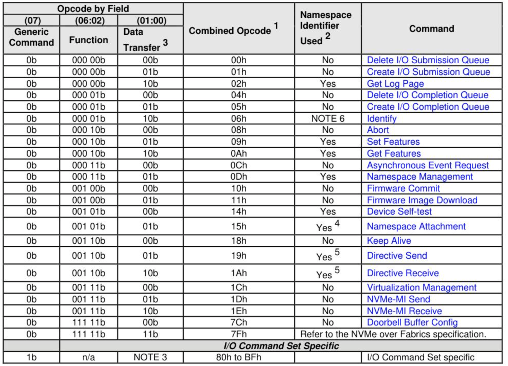
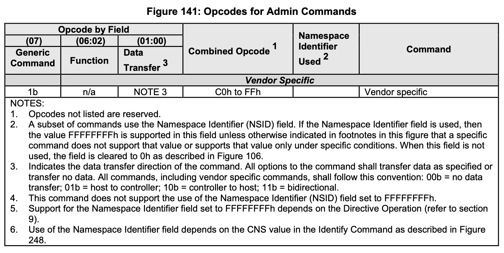
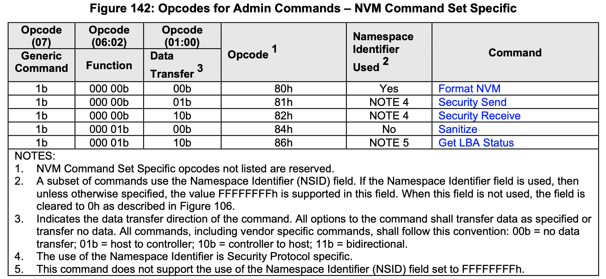

# 5 Admin命令集

管理命令集定义了可以提交到管理提交队列的命令。

提交队列条目（SQE）结构和所有管理命令的公用字段定义在4.2节中。完成队列条目（CQE）结构和所有管理命令公用字段定义在4.6节中。管理命令集的SQE和CQE结构中的命令特定字段（即SQE命令字段10到15和CQE字段0）定义在本节中。

管理命令不应受到 I/O 队列状态的影响（例如，满的 I/O 完成队列不应延迟或阻止 Delete I/O 提交队列命令）。

图 141 定义了管理命令，而图 142 定义了 I/O 命令集特定管理命令，这些命令是特定于 NVM 命令集的（即，NVM 命令集特定管理命令）。参见第 7.1 节，了解各种控制器类型的强制性、可选性和禁止性命令。

注释：
1. NVM命令集未列出的特定操作码是保留的。
2. 一部分命令使用名称空间标识符（NSID）字段。如果使用名称空间标识符字段，则除非另有说明，否则该字段支持FFFFFFFFh值。当该字段未使用时，该字段被清除为0h，如图106所示。
3. 表示命令的数据传输方向。命令的所有选项都应按指定方式传输数据或不传输数据。所有命令，包括厂商特定命令，都应遵循以下约定：00b = 不传输数据；01b = 主机到控制器；10b = 控制器到主机；11b = 双向。
4. 使用名称空间标识符是安全协议特有的。
5. 此命令不支持将名称空间标识符（NSID）字段设置为FFFFFFFFh。

## 5.1 终止命令

